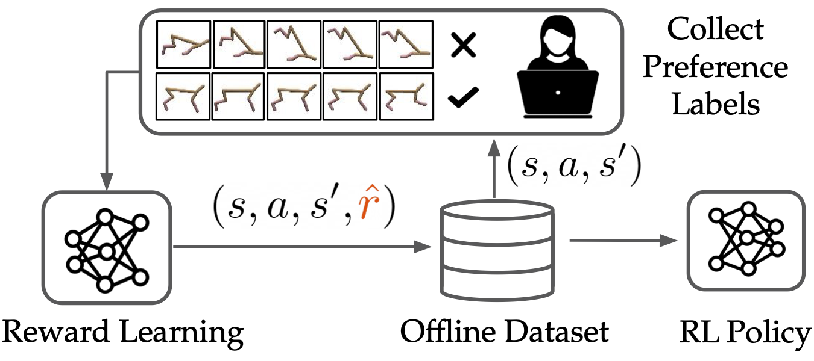

# Offline Preference-Based Reward Learning

Daniel Shin, Anca D. Dragan, Daniel S. Brown

## Overview

Codebase for Benchmarks and Algorithms for Offline Preference-Based Reward Learning.

## Dependencies
To install relevant create dependencies, create conda environment with 
``conda env create -f environment.yml``
Then install d4rl in the `d4rl` sub-directory.

## Instructions

We provide code in three sub-directories: `d4rl` containing slightly modified version of the original d4rl dataset, `reward_learning` containing code for preference-based reward learning, and `policy_learning` for training offline reinforcement learning policies.

See corresponding READMEs in each folder for instructions; scripts should be run from the respective directories.
It may be necessary to add the respective directories to your PYTHONPATH.
